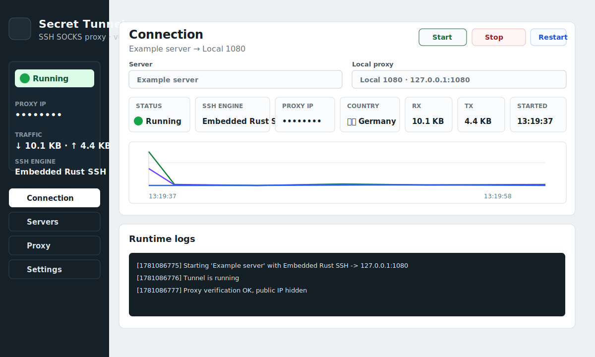
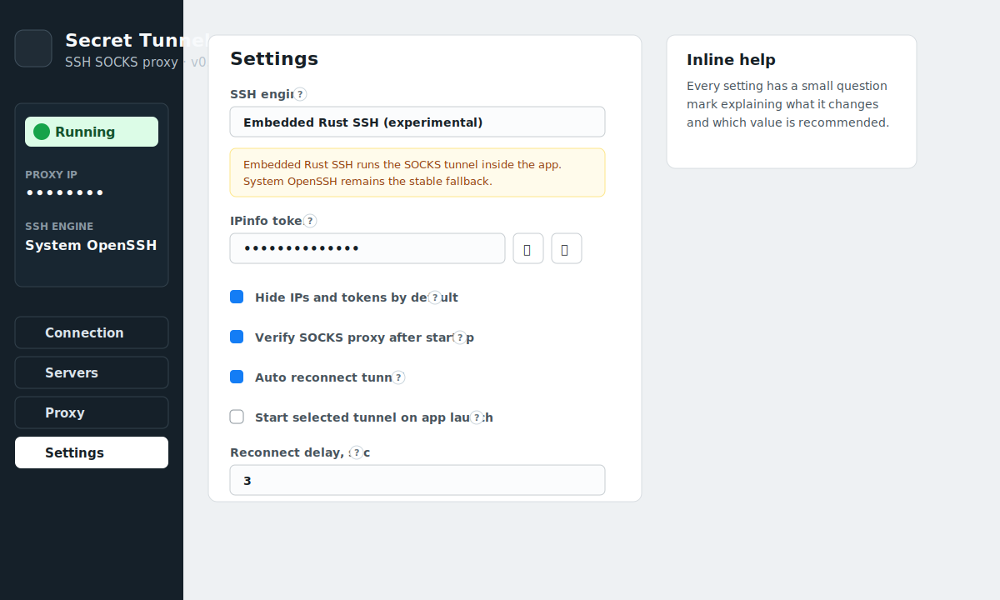

# Secret Tunnel

Desktop app for managing SSH dynamic SOCKS tunnels.





## What is inside

- `src/` - React/Vite interface.
- `src-tauri/` - Tauri 2 Rust backend.
- The backend starts and stops tunnels directly from Rust. The stable engine uses the system OpenSSH client; the experimental embedded engine is behind the `embedded-ssh` Cargo feature.
- Server profiles, local proxy profiles, selected connection, and IPinfo token are stored in:

```bash
~/.config/secret-tunnel/config.json
```

- The main screen lets you choose a server profile and a local proxy profile, then start or stop the tunnel.
- The status block shows tunnel state, proxy IP, country flag/country, and total received/sent traffic.
- The status block also shows the active SSH engine and app version to make support/debugging easier.
- The traffic graph reads per-process counters for the child `ssh` process in System OpenSSH mode. On macOS it uses `nettop`; other operating systems need their own sampler implementation. Embedded Rust SSH mode counts received/sent bytes inside the forwarding loop.
- The IP and country lookup uses the IPinfo Lite API through the running SOCKS proxy. Add the token on the Settings tab.
- The Settings tab includes inline help, per-setting defaults, and an option to clear runtime logs on tunnel start.

## Settings

The Settings tab has inline `?` tooltips for each option.

| Setting | What it does | Recommended value |
| --- | --- | --- |
| `SSH engine` | Chooses how the tunnel is created. `System OpenSSH` starts the system `ssh` binary. `Embedded Rust SSH` runs SSH/SOCKS forwarding inside the app via `russh`. | Use `System OpenSSH` for the most stable mode. Use `Embedded Rust SSH` when you build with `--embedded` or need Windows operation without `ssh.exe`. |
| `IPinfo token` | Enables proxy IP, country, and flag lookup through the running SOCKS proxy. | Optional. Leave empty if you do not need IP/country display. |
| `Hide IPs and tokens by default` | Masks sensitive values in the UI until the eye button is clicked. | On. Useful for screenshots, streams, and support tickets. |
| `Verify SOCKS proxy after startup` | Runs a test request through the local SOCKS proxy after the tunnel starts. | On. It catches broken tunnels early. |
| `Auto reconnect tunnel` | Restarts the selected tunnel after an unexpected SSH exit. | Optional. Enable for long-running connections. |
| `Start selected tunnel on app launch` | Starts the selected server/proxy pair when the app opens. | Off until the selected profile is tested. |
| `Clear logs on tunnel start` | Clears Runtime logs before starting a new tunnel. | Optional. Enable when debugging one clean run at a time. |
| `Reconnect delay, sec` | Wait time before auto reconnect. | `3` to `5` seconds is usually enough. |
| `Default` | Resets only application settings to safe defaults. Server and proxy profiles are not removed. | Use when settings become confusing. |

## Install prerequisites

Install Rust/Cargo:

```bash
curl --proto '=https' --tlsv1.2 -sSf https://sh.rustup.rs | sh
```

Then restart the terminal or run:

```bash
source "$HOME/.cargo/env"
```

Install Tauri system dependencies:

- macOS: Xcode Command Line Tools are required.
- Linux: install the WebKitGTK and build packages from the Tauri docs.
- Windows: install Microsoft C++ Build Tools, WebView2 runtime, Rust MSVC toolchain, and Node.js. OpenSSH Client is only required when using the `System OpenSSH` engine.

Windows build checklist:

1. Install Node.js LTS and npm.
2. Install Rust via rustup and use the MSVC toolchain:

```powershell
winget install --id Rustlang.Rustup
rustup default stable-msvc
```

3. Install Microsoft C++ Build Tools and select `Desktop development with C++`.
4. Install WebView2 Runtime if it is not already present.
5. If you plan to use `System OpenSSH`, ensure `ssh.exe` is available in `PATH`. Windows 10/11 usually provide OpenSSH Client as an optional feature.
6. If you build with `--embedded` and select `Embedded Rust SSH`, the app can run tunnels without `ssh.exe`.
7. If building MSI installers and `light.exe` fails, enable the Windows optional `VBSCRIPT` feature.

Official Tauri prerequisites:

- https://v2.tauri.app/start/prerequisites/
- https://v2.tauri.app/distribute/

## Install project dependencies

```bash
cd fr-tunnel-desktop
npm install
```

## Run in development

```bash
npm run tauri:dev
```

## Build app bundle

```bash
npm run tauri:build
```

Or use the helper script:

```bash
npm run release
npm run release:embedded
# or
scripts/build-release.sh current
scripts/build-release.sh current --embedded
```

The helper builds the current native platform and prints bundle artifacts. `--embedded` builds with the experimental `embedded-ssh` Cargo feature. On macOS it builds the `.app` bundle directly to avoid flaky DMG cleanup issues during local development. Run it on each target OS:

```bash
scripts/build-release.sh macos    # on macOS
scripts/build-release.sh linux    # on Linux
scripts/build-release.sh windows  # on Windows Git Bash/MSYS2
```

Native packaging for all three desktop OSes from one host is not attempted by this script. Use native machines or CI runners for macOS, Linux, and Windows.

For a full Tauri bundle set using `tauri.conf.json` targets, run:

```bash
npm run tauri:build
```

The macOS app bundle is created at:

```bash
src-tauri/target/release/bundle/macos/Secret Tunnel.app
```

## Notes

The app no longer depends on the Bash/autossh SwiftBar helper for normal tunnel operation.

The SSH tunnel mechanism is controlled by Rust. In the stable `System OpenSSH` mode, the SSH protocol itself is handled by the system `ssh` executable. Secret Tunnel launches a child process equivalent to:

```bash
ssh -NT -D 127.0.0.1:1080 -p 22 -i ~/.ssh/id_ed25519 user@example.com
```

Rust owns the app state, config, process lifecycle, logs, traffic sampling, IP lookup, reconnect logic, and UI commands.

The Settings tab has an `SSH engine` selector:

- `System OpenSSH` - current working engine, uses the system `ssh` executable.
- `Embedded Rust SSH` - experimental in-process `russh` implementation. Normal release builds return a clear error unless built with `--features embedded-ssh`.

The Rust project already has an `embedded-ssh` Cargo feature as the compile-time slot for this work:

```bash
cd src-tauri
cargo check --features embedded-ssh
```

At the moment this feature enables `russh`/`tokio`, starts a local SOCKS5 listener, authenticates with the configured private key, opens SSH `direct-tcpip` channels for SOCKS CONNECT requests, and counts RX/TX bytes in-process for the traffic graph. This path is still experimental; keep `System OpenSSH` as the stable default until the embedded engine is tested against your real server.

## Security Notes

- Do not commit real server IPs, usernames, private keys, IPinfo tokens, or local config files.
- The app stores its config at `~/.config/secret-tunnel/config.json`.
- The app stores the configured IPinfo token in that local config file.
- SSH private keys are not copied into config; the app reads the key from the configured path.
- In `Embedded Rust SSH`, `StrictHostKeyChecking=yes` requires a matching key in `~/.ssh/known_hosts`, `accept-new` records the first key, and `no` accepts any server key.
- Encrypted private keys with passphrases are not supported by the embedded engine yet. Use `System OpenSSH` or a dedicated key without passphrase for current embedded testing.
